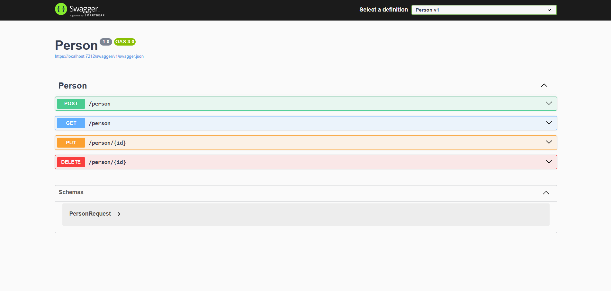
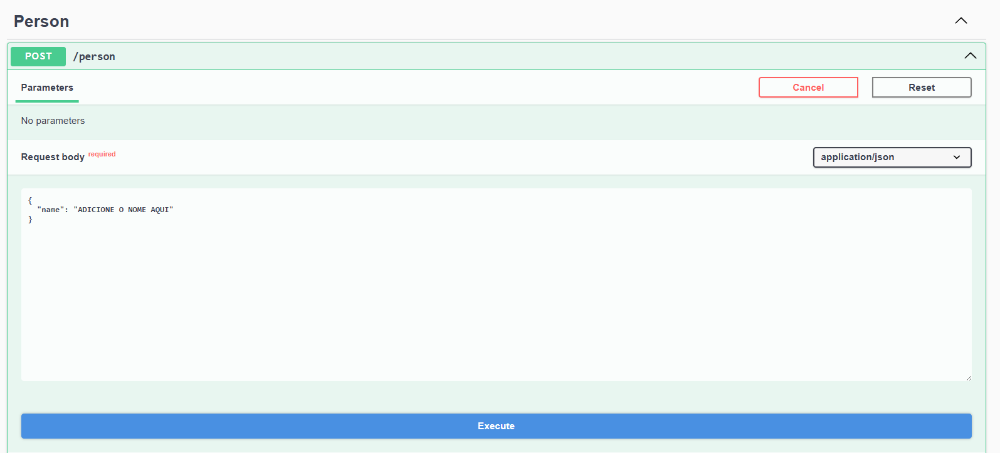
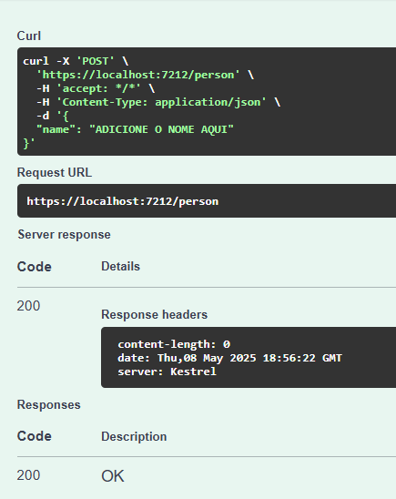
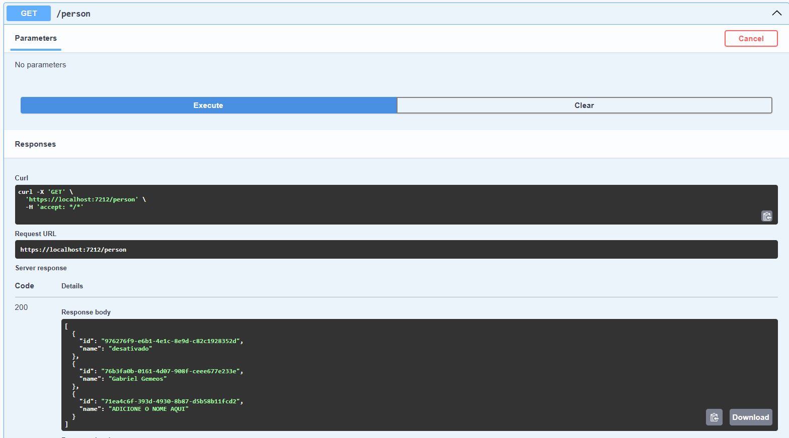

# .NET-APIrest



API RESTful desenvolvida em .NET para gerenciamento de pessoas, utilizando Entity Framework e SQLite.

---

## Funcionalidades

- CRUD completo de pessoas (Create, Read, Update, Delete)
- Integração com banco de dados SQLite
- Documentação automática via Swagger

---

## Como rodar o projeto

1. **Clone o repositório:**
   ```bash
   git clone https://github.com/rankioshi/.NET-APIrest.git
   ```
2. **Acesse a pasta do projeto:**
   ```bash
   cd .NET-APIrest
   ```
3. **Restaure os pacotes e rode a aplicação:**
   ```bash
   dotnet restore
   dotnet run
   ```
4. **Acesse o Swagger:**
   Normalmente disponível em `http://localhost:5000/swagger` ou conforme configurado no projeto.

---

## Estrutura do Projeto

- **Data/**: Contexto do banco de dados e configurações do Entity Framework
- **Migrations/**: Migrações do banco de dados
- **Models/**: Modelos de dados (ex: Person)
- **Routes/**: Rotas/endpoints da API

---

## Exemplos de Uso

### 1. Listagem de Pessoas

```
GET /api/person
```

### 2. Cadastro de Pessoa

```
POST /api/person
Body: {
  "name": "Exemplo",
  "age": 30
}
```

---

## Imagens do Projeto

**Exemplo de Requisição no Swagger**





**Confirmação no Get**


---

## Observações

- Certifique-se de que o arquivo `appsettings.json` está configurado corretamente para o ambiente local.
- O banco de dados SQLite já está incluído no repositório, mas pode ser recriado via migrations se necessário.
- Requisições como PUT e DELETE necessitam do ID

---

## Contribuição

Sinta-se à vontade para abrir issues ou pull requests.

---

## Licença

Este projeto está sob a licença MIT.
